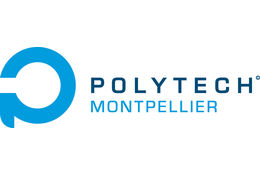
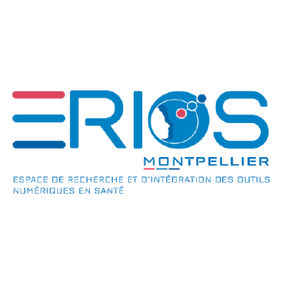

### Polytech Montpellier – FLOW Summer School

* **Course material:** [Wooclap](https://app.wooclap.com/YMSNKO) 
* **Teacher:** [Xavier CORBIER](https://xaviercorbier.fr/?lang=en)

# Table of contents
- Session 1: Introduction to Large Language Models (LLMs) 
  - [Part 1: Overview of Language Models ](./sessions/S1-P1.md)
  - [Part 2: Introduction to Responsible AI ](./sessions/S1-P2.md)
  - [Part 3: Safety & Fairness Considerations for Generative Models ](./sessions/S1-P3.md)
- Session 2: Working with Large Language Models 
  - [Part 1: Prompt Engineering](./sessions/S2-P1.md)
  - [Part 2: Getting Started with ChatGPT](./sessions/S2-P2.md)
  - [Part 3: The Top 10 ChatGPT alternatives to ChatGPT](./sessions/S2-P3.md)
- Session 3: Developing with Generative AI Models  
  - [Part 1: Getting Started with Hugging Face](./sessions/S3-P1.md)  [[Notebook Version](https://colab.research.google.com/drive/1uGP4fY0YGokoBkX_5DiyS4gTTlZQNcGw?usp=sharing)]
  - [Part 2: Fine tuning LLM](./sessions/S3-P2.md) [[Notebook Version](https://colab.research.google.com/drive/1_s5BeyYQhxr6P_FKPEkPyeXvhEn1LPNc?usp=sharing)]
  - [Part 3: What is Retrieval-augmented generation (RAG)](./sessions/S3-P3.md)

# For further exploration
- [Datacamp: AI fundamentals](https://app.datacamp.com/learn/skill-tracks/ai-fundamentals)
- [Microsoft: Career path engineer AI](https://learn.microsoft.com/fr-fr/training/career-paths/ai-engineer)

# References
- [Google: Getting started with Machine learning](https://developers.google.com/machine-learning/resources?hl=en)
- [Stanford: Getting Started with ChatGPT](https://uit.stanford.edu/service/techtraining/class/getting-started-chatgpt)
- [Datacamp: The Top 10 ChatGPT Alternatives You Can Try Today](https://www.datacamp.com/blog/10-chatgpt-alternatives)
- [FreeCodeCamp: How to Get Started with Hugging Face](https://www.freecodecamp.org/news/get-started-with-hugging-face/)
- [Datacamp: Fine tuning LLM](https://www.datacamp.com/tutorial/fine-tuning-large-language-models)
- [Nvidia: What Is Retrieval-Augmented Generation, aka RAG?](https://blogs.nvidia.com/blog/what-is-retrieval-augmented-generation/)

  
    
  
  

