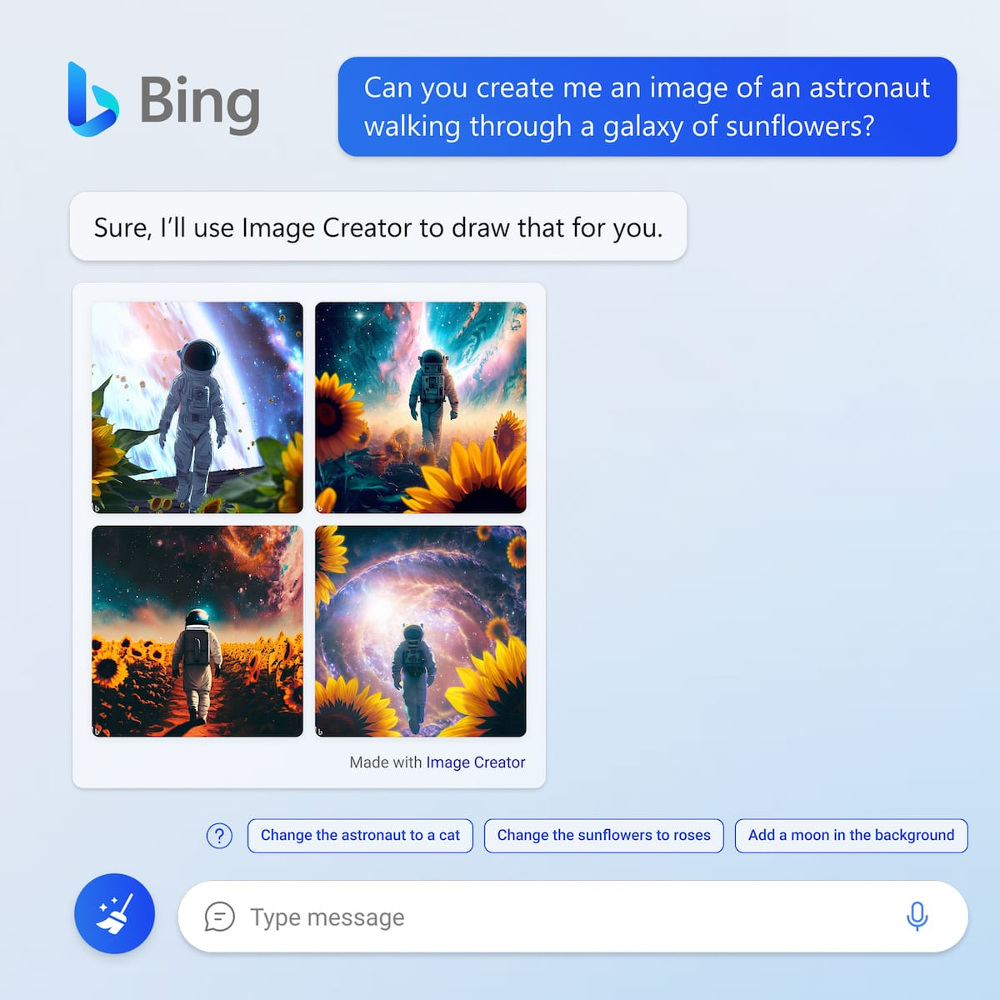
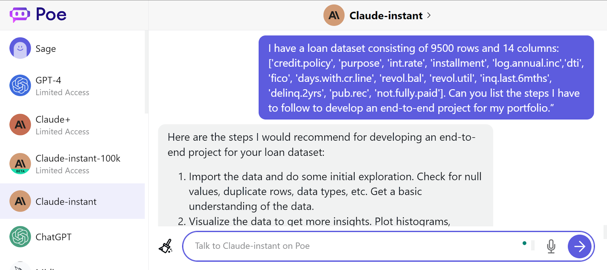
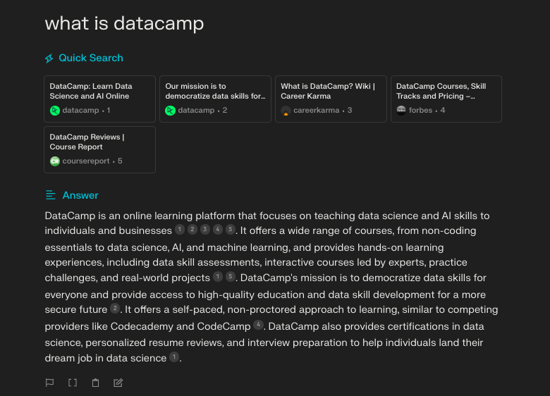
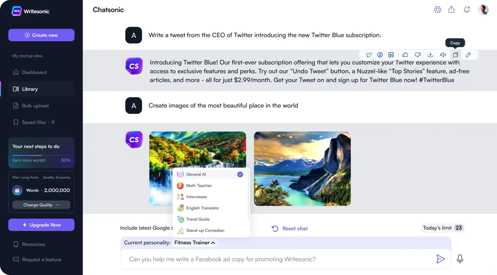
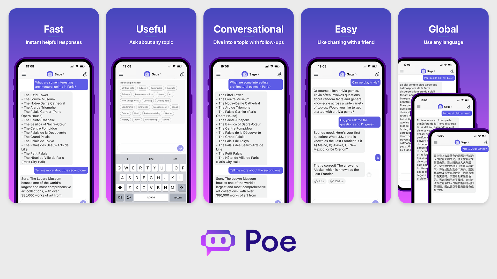
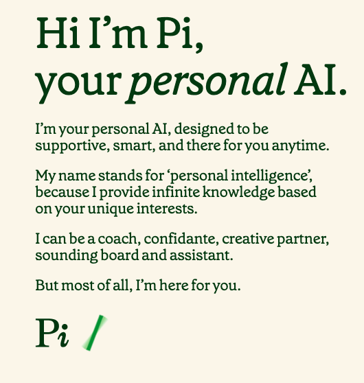
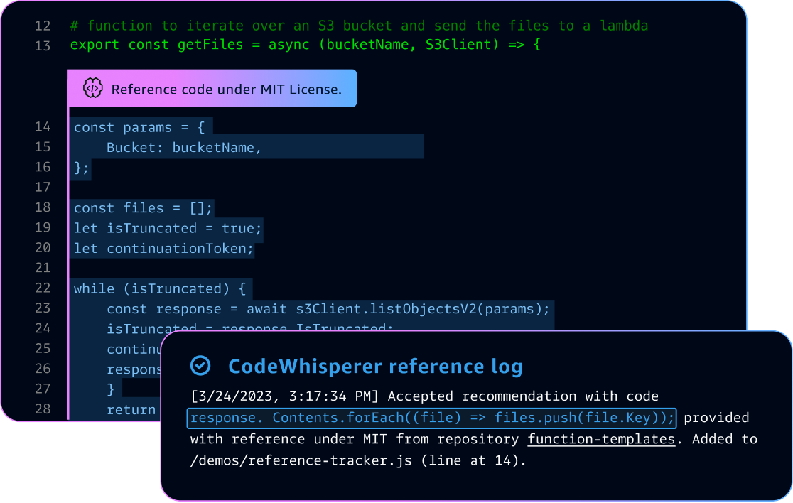
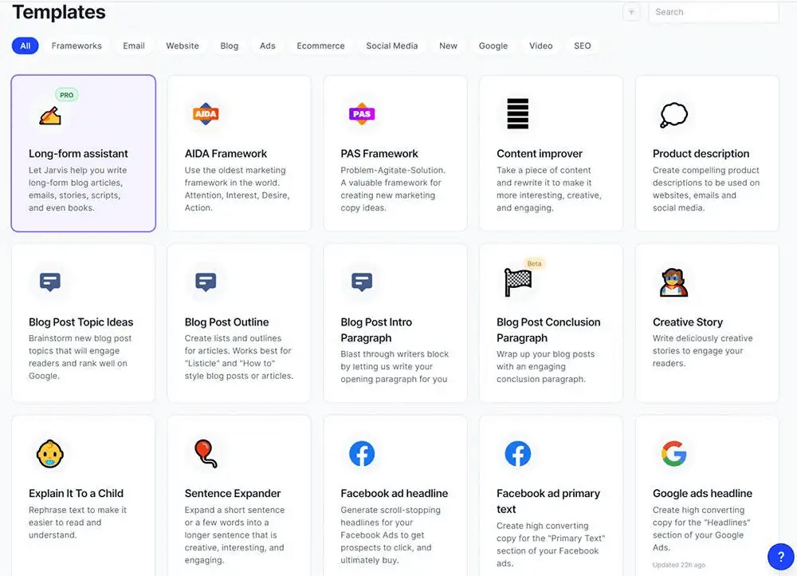

# Session 2: Working with Large Language Models 
## Part 3: The Top 10 ChatGPT alternatives to ChatGPT
In this section, you can find our curated list of the top 10 ChatGPT alternatives. Each AI tool is accompanied by a brief description and its pros and cons. At the end of this section, you can find a summary table.

### Bing AI
ChatGPT was developed by OpenAI with funding and support from Microsoft. Following the successful launch of the tool, the next move for Microsoft was to place itself at the forefront of the AI revolution by integrating ChatGPT's capabilities into its own search engine, Bing.

Bing is now an AI search engine powered by GPT-4, a next-generation LLM that is considered more advanced than its predecessor GPT-3.5, which powered ChatGPT. It also integrates Dall-E 2, a text-to-image LLM. This allows Bing to embrace multimodality, meaning the engine can answer users' questions with text and images.

Designed as an interactive chat experience, the key benefit of Bing is its ability to provide up-to-date results with cited sources to ensure credibility. Also, Bing is available for free. However, there is a limited number of prompts you can make in a session, and sometimes you can encounter slow speed. Also, as with any other LLM, Bing can sometimes throw inaccurate and biased results.

### Google Bard
Regarded as the main rival of ChatGPT, Bard is a generative AI tool developed by Google. The latest version of Bard is powered by Google’s language model PaLM 2 model, offering improved performance in reasoning, coding, and multilingual capabilities. It’s well suited for creative tasks, provides cited sources, and it’s available for free.

Despite its latest improvements, Google’s Bard is still in its infancy, delivering only a fraction of its full potential. In the coming versions, Bard will include multimodality, combining text and images in its answers. Equally, you will be able to include images in your prompts. Also, integrating Bard with other Google tools, like Google Lens, promises incredible results.

### Claude
Developed by Google-backed company Anthropic, Claude is a next-generation AI assistant carefully designed following Constitutional AI principles to ensure it only provides helpful, honest, and harmless answers.

There are currently two versions of the tool: Claude 2 and Claude Instant. The former is a more powerful model, excelling at a wide range of tasks from sophisticated dialogue and creative content generation to detailed instruction. The latter is a faster, cheaper, yet still very capable model, which can handle a range of tasks, including casual dialogue, text analysis, summarization, and document comprehension. Both models can be customized to your needs using prompting.

Claude can be used to create downstream applications through its API. However, this option is only limited to a certain number of users, so adoption of the tool is still nascent. If you want to try it for free to have a grasp of how it works, you can use it with the Vercel AI Playground, Poe, and Slack.

### Perplexity
Using the OpenAI API, Perplexity AI is an excellent alternative to ChatGPT. Designed following a minimalist, dark interface, Perplexity offers a great conversational experience. You don’t even have to create an account to use its free version, which is powered by GPT-3.

Perplexity comes with several cool features, such as threads which allow you to revisit previous conversations with Perplexity, and search focus, which enables you to fine-tune your search by narrowing down the sources. Furthermore, Perplexity is conceived to address the authenticity and copyright problems of ChatGPT, providing source cites in all its answers. Check, for example, its reply when we ask what Datacamp is.

Finally, Perplexity also comes with a Pro version powered by GPT-4. The premium subscriptions include Copilot, an interactive search assistant that asks you clarifying questions to guide the AI search process and find the best answer for you.

### ChatSonic
Branded as a conversational AI that addressed the limitations of ChatGPT, ChatSonic is a solid alternative for those interested in content creation and creative tasks.

The latest version of ChatSonic is powered by GPT-4 and Google Search, which can give you up-to-date information. It also offers multimodal replies and customized answers based on avatars.

However, contrary to ChatGPT, the interface can be a bit complex and saturated. Also, the conversation can be slow, and ChatSonic can lose focus on an exchange after several prompts.

The tool brands itself as a free alternative to ChatGPT. While there is a free version, it is quite limited, with only 10.000 words per month. If you want to leverage its full potential, you have to pay for a subscription.

### Poe
ChatGPT, Bing, or Bard are great tools, but each has strengths and weaknesses. Wouldn’t it be great to have all these chatbots in the same place, so you can seamlessly switch between them? That’s the idea behind Poe.

Developed by Quora, Poe uses state-of-the-art models like GPT-3.5-Turbo, GPT-4, Claude +, LlaMA 2, PaLM, and many other large language models (LLMs). Further, it allows you to create personalized chatbots using initial prompts.

Poe is fast, easy to use, and provides accurate answers based on prompts that can be passed through different chatbots as if you were sending the same message to different friends on WhatsApp.

Although Poe includes a free version, you have to purchase the premium version to use all the available AI models without limit.

### Pi
Designed by Inflection AI, Pi is a personal AI assistant designed to be supportive, smart, and always available. Pi stands for “personal intelligence” and has been designed to orient its behavior toward users' unique interests.

In many ways, Pi is one of the most innovative alternatives to ChatGPT. First, it’s clearly oriented to smartphones. It’s available on several popular platforms, including WhatsApp, Facebook, and Instagram, and has its own iOS app. It is also available through its website. Second, you can speak to Pi instead of just chatting using one of its charming and comforting voices.

However, Pi is still nascent in development. It can suffer hallucinations and may not be capable of answering complex questions. It also struggles with languages other than English. Moreover, for now, it doesn’t yet know about events after November 2022. Finally, Pi is currently only available for Apple, so Android users must wait.

### Amazon CodeWhisperer
Another tool in the realm of AI coding assistants like GitHub Copilot is Amazon CodeWhisperer. Trained with a vast corpus of open-source code and code hosted in Amazon servers, CodeWhisperer helps developers with coding recommendations, security checks, and much more.

As an Amazon product, CodeWhisper is particularly well-suited for developers working with Amazon services, although it can also be used in popular integrated development environments IDEs), like JupyterLab, VS Code, and PyCharm, and performs remarkably well with Python, Java, and JavaScript. Another great point is that CodeWhisperer can be used for free by developers across the world.

Finally, it’s also worth mentioning that CodeWhisperer provides source citations for generated code suggestions, which is great for providing attribution and enhancing security.

By contrast, compared to GitHub Copilot, Amazon CodeWhisperer supports a narrower range of programming languages and has limited integration options.

### Jasper AI
If you are working in marketing, SEO, or any related field, Jasper AI is one of the best options. Designed by Jasper, an on-brand AI platform for businesses, Jasper AI is a conversational AI chatbot that can help you in a wide variety of content creation tasks, such as writing blog articles, brainstorming title ideas, editing emails to adopt a certain tone, or writing love letters.

Powered by a mix of the best-in-class LLMs, including OpenAI's GPT-4, Claude, and Google's models, Jasper AI is capable of learning and adapting to your voice in order to keep the tone of your brand consistent. It’s a highly efficient assistant that can help you write complete pieces in a matter of seconds, thanks to its high-quality templates designed for over 50 different use cases. Another great point of Jasper AI is that it’s been trained in more than 30 languages, thereby allowing you to launch marketing campaigns in multiple countries.

While Jasper AI is a great tool for content creation, it can struggle with more technical questions. Also, users have reported that the generated replies can sometimes be generic and repetitive and always requires fact-checking. Finally, and unfortunately, there isn’t a free version of Jasper, which comes with several plans starting at $39/month.

### DataLab
Last but not least, let’s talk about the DataLab AI assistant. Datacamp has recently introduced an AI coding assistant in our data science notebook, DataLab. Designed with data democratization in mind, DataLab initially gained traction among learners building portfolios for their data science careers. It became a valuable tool for team collaboration and organizational learning across various industries as it evolved.

With the new AI Assistant, DataLab aims to make data science even more accessible and productive for data practitioners. This includes the "Fix Error" button, which not only corrects code errors but also explains them, making it the perfect tool in learning environments. The “Generate Code” feature allows you to generate code based on natural language queries and answer key questions about a dataset. Additionally, the AI Assistant provides intelligent suggestions based on existing code and context, making code writing smarter and more efficient.

