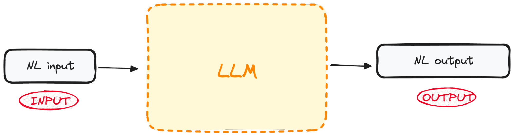
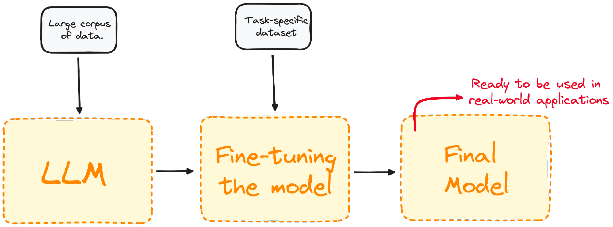
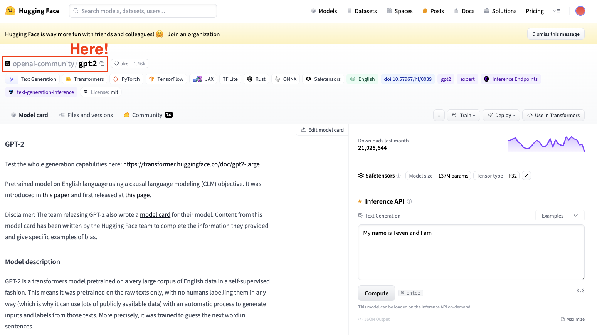
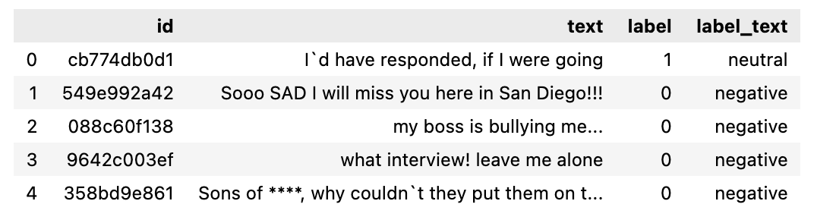

# Session 3: Developing with Generative AI Models  
## Part 2: Fine tuning LLM

Fine-tuning Large Language Models (LLMs) has revolutionized Natural Language Processing (NLP), offering unprecedented capabilities in tasks like language translation, sentiment analysis, and text generation. This transformative approach leverages pre-trained models like GPT-2, enhancing their performance on specific domains through the fine-tuning process.

Over the last year and a half, the field of natural language processing (NLP) has undergone a significant transformation due to the popularization of Large Language Models (LLMs). The natural language skills that these models present have allowed applications that seemed impossible to achieve a few years ago.

LLMs are pushing the boundaries of what was previously considered achievable with capabilities ranging from language translation to sentiment analysis and text generation.

However, we all know training such models is time-consuming and expensive. This is why, fine-tuning large language models is important for tailoring these advanced algorithms to specific tasks or domains.

This process enhances the model's performance on specialized tasks and significantly broadens its applicability across various fields. This means we can take advantage of the Natural Language Processing capacity of pre-trained LLMs and further train them to perform our specific tasks.

Today, explore the essence of pre-trained language models and further delve into the fine-tuning process.

So, let’s navigate through practical steps for fine-tuning a model like GPT-2 using Hugging Face.

```bash
pip install evaluate transformers[torch]
pip install accelerate -U
```

### Understanding How Pre-trained Language Models Work

The Language Model is a type of machine learning algorithm designed to forecast the subsequent word in a sentence, drawing from its preceding segments. It is based on the Transformers architecture. 

Pre-trained language models, such as GPT (Generative Pre-trained Transformer), are trained on vast amounts of text data. This enables LLMs to grasp the fundamental principles governing the use of words and their arrangement in the natural language.



The most important part is that these models are not only good at understanding natural language but are also good at generating human-like text based on the input they receive.

And the best part of it all?

These models are already open to the masses using APIs. If you want to learn how to take advantage of OpenAI’s most powerful LLMs, you can learn how to do it by following this cheat sheet on [OpenAI’s API](https://www.datacamp.com/cheat-sheet/the-open-ai-api-in-python).

#### What is Fine-tuning, and Why is it Important?

Fine-tuning is the process of taking a pre-trained model and further training it on a domain-specific dataset.

Most LLM models today have a very good global performance but fail in specific task-oriented problems. The fine-tuning process offers considerable advantages, including lowered computation expenses and the ability to leverage cutting-edge models without the necessity of building one from the ground up.

Transformers grant access to an extensive collection of pre-trained models suited for various tasks. Fine-tuning these models is a crucial step for improving the model's ability to perform specific tasks, such as sentiment analysis, question answering, or document summarization, with higher accuracy.



Fine-tuning tailors the model to have a better performance for specific tasks, making it more effective and versatile in real-world applications. This process is essential for tailoring an existing model to a particular task or domain.

Whether to engage in fine-tuning hinges on your goals, which typically vary based on the specific domain or task at hand.

#### The Different Types of Fine-tuning
Fine-tuning can be approached in several ways, depending mainly on its main focus and specific goals.

##### Supervised fine-tuning
The most straightforward and common fine-tuning approach. The model is further trained on a labeled dataset specific to the target task to perform, such as text classification or named entity recognition.

For instance, we would train our model on a dataset containing text samples labeled with their corresponding sentiment for sentiment analysis.

##### Few-shot learning
There are some cases where collecting a large labeled dataset is impractical. Few-shot learning tries to address this by providing a few examples (or shots) of the required task at the beginning of the input prompts. This helps the model have a better context of the task without an extensive fine-tuning process.

##### Transfer learning
Even though all fine-tuning techniques are a form of transfer learning, this category is specifically aimed to allow a model to perform a task different from the task it was initially trained on. The main idea is to leverage the knowledge the model has gained from a large, general dataset and apply it to a more specific or related task.

##### Domain-specific fine-tuning
This type of fine-tuning tries to adapt the model to understand and generate text that is specific to a particular domain or industry. The model is fine-tuned on a dataset composed of text from the target domain to improve its context and knowledge of domain-specific tasks.

For instance, to generate a chatbot for a medical app, the model would be trained with medical records, to adapt its language understanding capabilities to the health field.

#### A Step-by-Step Guide to Fine-tuning a LLM
We already know that Fine-tuning is the process of taking a pre-trained model and updating its parameters by training on a dataset specific to your task. So, let’s exemplify this concept by fine-tuning a real model.

Imagine we are working with GPT-2, but we detect it is quite bad at inferring the sentiments of tweets.

One natural question that comes to mind is: Can we do something to improve its performance?

We can take advantage of fine-tuning by training our pre-trained GPT-2 model from the Hugging Face model with a dataset containing tweets and their corresponding sentiments so the performance improves. Here's a basic example of fine-tuning a model for sequence classification:

##### Step 1: Choose a pre-trained model and a dataset
To fine-tune a model, we always need to have a pre-trained model in mind. In our case, we are going to perform some simple fine-tuning using GPT-2.



Always keep in mind to select a model architecture suitable for your task.

##### Step 2: Load the data to use
Now that we have our model, we need some good-quality data to work with, and this is precisely where the datasets library kicks in.

In my case, I will use the Hugging Face datasets library to import a dataset containing tweets segmented by their sentiment (Positive, Neutral or Negative).

```python
from datasets import load_dataset
import pandas as pd

dataset = load_dataset("mteb/tweet_sentiment_extraction")
df = pd.DataFrame(dataset['train'])
```

If we check the dataset we just downloaded, it is a dataset containing a subset for training and a subset for testing. If we convert the training subset to a dataframe, it looks as follows.



##### Step 3: Tokenizer
Now that we already have our dataset, we need a tokenizer to prepare it to be parsed by our model.

As LLMs work with tokens, we require a tokenizer to process the dataset. To process your dataset in one step, use the Datasets map method to apply a preprocessing function over the entire dataset.

This is why the second step is to load a pre-trained Tokenizer and tokenize our dataset so it can be used for fine-tuning.

```python
from transformers import GPT2Tokenizer

# Loading the dataset to train our model
dataset = load_dataset("mteb/tweet_sentiment_extraction")

tokenizer = GPT2Tokenizer.from_pretrained("gpt2")
tokenizer.pad_token = tokenizer.eos_token
def tokenize_function(examples):
   return tokenizer(examples["text"], padding="max_length", truncation=True)

tokenized_datasets = dataset.map(tokenize_function, batched=True)
```

To improve our processing requirements, we can create a smaller subset of the full dataset to fine-tune our model. The training set will be used to fine-tune our model, while the testing set will be used to evaluate it.

```python
small_train_dataset = tokenized_datasets["train"].shuffle(seed=42).select(range(1000))
small_eval_dataset = tokenized_datasets["test"].shuffle(seed=42).select(range(1000))
```

##### Step 4: Initialize our base model
Start by loading your model and specify the number of expected labels. From the Tweet’s sentiment dataset card, you know there are three labels:

```python
from transformers import GPT2ForSequenceClassification

model = GPT2ForSequenceClassification.from_pretrained("gpt2", num_labels=3)
```

##### Step 5: Evaluate method
Transformers provides a Trainer class optimized for training. However, this method does not include how to evaluate the model. This is why, before starting our training, we will need to pass Trainer a function to evaluate our model performance.

```python
import evaluate

metric = evaluate.load("accuracy")

def compute_metrics(eval_pred):
   logits, labels = eval_pred
   predictions = np.argmax(logits, axis=-1)
   return metric.compute(predictions=predictions, references=labels)
```

##### Step 6: Fine-tune using the Trainer Method
Our final step is to set up the training arguments and start the training process. The Transformers library contains the Trainer class, which supports a wide range of training options and features such as logging, gradient accumulation, and mixed precision. We first define the training arguments together with the evaluation strategy. Once everything is defined, we can easily train the model simply using the train() command.

```python
from transformers import TrainingArguments, Trainer

training_args = TrainingArguments(
   output_dir="test_trainer",
   per_device_train_batch_size=1,  # Reduce batch size here
   per_device_eval_batch_size=1,    # Optionally, reduce for evaluation as well
   gradient_accumulation_steps=4
   )


trainer = Trainer(
   model=model,
   args=training_args,
   train_dataset=small_train_dataset,
   eval_dataset=small_eval_dataset,
   compute_metrics=compute_metrics,

)

trainer.train()
```
After training, evaluate the model's performance on a validation or test set. Again, the trainer class already contains an evaluate method that takes care of this.
```python
import evaluate

trainer.evaluate()
```
These are the most basic steps to perform a fine-tuning of any LLM. Remember to fine-tune a LLM is highly computationally demanding, and your local computer might not have enough power to do so.

### Fine-tuning Best Practices
To ensure successful fine-tuning, consider the following best practices:

#### Data Quality and Quantity
The quality of your fine-tuning dataset significantly impacts the model's performance. We all know the sentence:

“Gargabe in, Garbage Out”

So, always ensure the data is clean, relevant, and sufficiently large.

#### Hyperparameter tuning
Fine-tuning is usually a long process that needs to be iterated. Always explore various settings for learning rates, batch sizes, and the number of training epochs to identify the best setup for your project.

Precise adjustments are key to ensuring the model learns efficiently and adapts well to unseen data, avoiding the pitfall of overfitting.

#### Regular evaluation
Regularly assess the model's progress during training to track its effectiveness and implement required modifications. This involves evaluating the model's performance using a distinct validation dataset throughout the training period.

Such evaluation is critical for determining the model's performance of the task at hand and its potential for overfitting to the training dataset. Based on the outcomes from the validation phase, adjustments can be made as needed to optimize performance.

### Avoiding LLM Fine-Tuning Pitfalls
Fine-tuning can sometimes lead to suboptimal outcomes. Be wary of the following pitfalls:

#### Overfitting
Using a small dataset for training or extending the number of epochs excessively can produce overfitting. This is usually characterized by the model showing high accuracy on our training dataset but failing to generalize to new data.

#### Underfitting
Conversely, insufficient training or a low learning rate can result in underfitting, where the model fails to learn the task adequately.

#### Catastrophic forgetting
In the process of fine-tuning for a particular task, there's a risk that the model might lose the broad knowledge it initially acquired. This issue, referred as catastrophic forgetting, can diminish the model's ability to perform well across a variety of tasks using natural language processing.

#### Data leakage
Always make sure that training and validation datasets are separate and that there's no overlap, as this can give misleading high-performance metrics.

### Final thoughts and future steps.
Embarking on the journey of fine-tuning large language models opens up a world of possibilities for AI applications.

By understanding and applying the concepts, practices, and precautions outlined, one can effectively adapt these powerful models to meet specific needs, unlocking their full potential in the process.