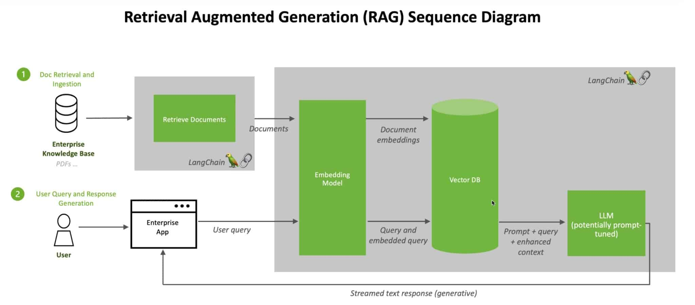

# Session 3: Developing with Generative AI Models  
## Part 3: Qu’est-ce que la génération augmentée par récupération (RAG) ?

La **génération augmentée par récupération** (Retrieval-Augmented Generation ou RAG) est une technique qui améliore la précision et la fiabilité des modèles d’intelligence artificielle générative en intégrant des faits provenant de sources externes.

### Une métaphore : imaginez un tribunal
Pour comprendre cette avancée récente en matière d’intelligence artificielle générative, imaginez une salle d’audience.  

Les juges rendent leurs décisions en se basant sur leur connaissance générale du droit. Cependant, certains cas, comme des poursuites pour faute professionnelle ou des litiges de travail, nécessitent une expertise spécifique. Dans ces situations, les juges envoient des greffiers à une bibliothèque juridique pour rechercher des précédents et des cas spécifiques à citer.  

À l’image d’un bon juge, les grands modèles de langage (**LLMs**) peuvent répondre à une grande variété de questions humaines. Cependant, pour fournir des réponses autoritaires et citées, le modèle a besoin d’un assistant capable de mener des recherches.  

Dans le monde de l’IA, le greffier s’appelle **génération augmentée par récupération**, ou **RAG**.  

### Origine du terme « RAG »
Patrick Lewis, auteur principal de l’article de 2020 qui a introduit ce terme, s’est excusé pour cet acronyme peu flatteur. Aujourd’hui, il désigne une famille croissante de méthodes décrites dans des centaines de publications et utilisées dans de nombreux services commerciaux.  

« Nous aurions certainement réfléchi davantage au nom si nous avions su que notre travail deviendrait si répandu », a déclaré Lewis dans une interview à Singapour, où il partageait ses idées avec une conférence régionale de développeurs de bases de données.  

« Nous avions prévu de trouver un nom plus attrayant, mais quand il a fallu soumettre l’article, aucune meilleure idée ne s’est imposée », a ajouté Lewis, aujourd’hui responsable d’une équipe RAG au sein de la startup d’IA **Cohere**.  

### Qu’est-ce que la génération augmentée par récupération (RAG) ?
La **génération augmentée par récupération (RAG)** est une méthode qui améliore la précision et la fiabilité des modèles d’intelligence artificielle générative en intégrant des faits provenant de sources externes.  

En d’autres termes, elle comble une lacune dans le fonctionnement des LLMs. Sous le capot, les LLMs sont des réseaux neuronaux mesurés par leur nombre de paramètres, qui représentent les schémas généraux d’utilisation des mots par les humains pour former des phrases.  

Cette compréhension profonde, parfois appelée **connaissance paramétrique**, permet aux LLMs de répondre rapidement à des requêtes générales. Cependant, elle n’est pas suffisante pour répondre aux utilisateurs souhaitant explorer un sujet spécifique ou récent en profondeur.  

#### Combinaison de ressources internes et externes
Lewis et ses collègues ont développé RAG pour connecter les services d’IA générative à des ressources externes, notamment celles riches en détails techniques à jour.  

L’article, coécrit par des chercheurs de Facebook AI Research (aujourd’hui Meta AI), University College London et New York University, a qualifié RAG de « recette générale de fine-tuning » car elle peut être utilisée avec presque tous les LLMs pour se connecter à pratiquement toutes les ressources externes.  

#### Instaurer la confiance des utilisateurs
RAG permet aux modèles d’inclure des sources qu’ils peuvent citer, comme des notes de bas de page dans un article de recherche, afin que les utilisateurs puissent vérifier les affirmations. Cela renforce la confiance.  

De plus, cette méthode aide les modèles à clarifier les ambiguïtés dans les requêtes des utilisateurs et réduit le risque que le modèle fasse une supposition erronée, un phénomène parfois appelé **hallucination**.  

#### Facilité d’implémentation
Un autre avantage de RAG est sa simplicité. Un blog de Lewis et trois co-auteurs de l’article a souligné que les développeurs peuvent mettre en œuvre cette méthode avec seulement **cinq lignes de code**.  

Cela rend la méthode plus rapide et moins coûteuse que le réentraînement d’un modèle avec des ensembles de données supplémentaires. De plus, elle permet aux utilisateurs de remplacer rapidement les sources à la volée.  

### Comment les utilisateurs exploitent RAG

Avec la génération augmentée par récupération (**RAG**), les utilisateurs peuvent interagir directement avec des dépôts de données, ouvrant ainsi la porte à de nouvelles expériences. Cela signifie que les applications de RAG pourraient être multipliées par le nombre de jeux de données disponibles.

Par exemple, un modèle d’IA générative enrichi par un index médical pourrait devenir un excellent assistant pour les médecins ou infirmiers. Les analystes financiers, quant à eux, profiteraient d’un assistant connecté à des données de marché.

En réalité, presque toute entreprise peut transformer ses manuels techniques ou politiques, vidéos ou journaux en **bases de connaissances** qui enrichissent les LLMs. Ces sources permettent des cas d’usage tels que :  
- Le support client ou sur le terrain.  
- La formation des employés.  
- L’augmentation de la productivité des développeurs.  

C’est cette immense possibilité qui pousse des entreprises comme **AWS, IBM, Glean, Google, Microsoft, NVIDIA, Oracle et Pinecone** à adopter RAG.  

---

### Premiers pas avec la génération augmentée par récupération  

Pour faciliter la prise en main, **NVIDIA** a développé un workflow d’IA dédié à RAG. Celui-ci inclut :  
- Un chatbot d’exemple.  
- Les éléments nécessaires pour créer des applications basées sur cette méthode.

Ce workflow s’appuie sur :  
- **NVIDIA NeMo** : un cadre pour développer et personnaliser des modèles d’IA générative.  
- **NVIDIA Triton Inference Server** et **NVIDIA TensorRT-LLM** : des outils pour exécuter ces modèles en production.

Tous ces composants font partie de la plateforme **NVIDIA AI Enterprise**, qui accélère le développement et le déploiement d’IA prête pour la production avec les garanties de sécurité, de support et de stabilité nécessaires aux entreprises.

Pour obtenir les meilleures performances avec les workflows RAG, il faut des ressources importantes en mémoire et en calcul pour traiter les données. Le **NVIDIA GH200 Grace Hopper Superchip**, avec sa mémoire HBM3e rapide de 288 Go et sa puissance de calcul de 8 pétaflops, est idéal. Il offre une accélération jusqu’à **150 fois** par rapport à l’utilisation d’un CPU.  

Une fois que les entreprises maîtrisent RAG, elles peuvent combiner des LLMs standard ou sur mesure avec des bases de connaissances internes ou externes pour créer une variété d’assistants qui aident leurs employés et leurs clients.  

RAG ne nécessite pas un centre de données. Les LLMs arrivent désormais sur les PC Windows, grâce aux logiciels NVIDIA qui rendent ces applications accessibles, même sur des ordinateurs portables.  

---

### Utilisation locale de RAG  

Les PC équipés de **NVIDIA RTX GPUs** peuvent exécuter certains modèles d’IA localement. En utilisant RAG sur un PC, les utilisateurs peuvent se connecter à des sources de données privées (e-mails, notes, articles) pour améliorer les réponses. Ils bénéficient ainsi d’une confidentialité totale concernant leurs données, leurs requêtes et leurs réponses.

Un blog récent montre comment **TensorRT-LLM** pour Windows accélère RAG, obtenant de meilleurs résultats en un temps réduit.  

---

### Historique de RAG  

Les racines de cette technique remontent aux **années 1970**, lorsque des chercheurs en recherche d’information ont développé des prototypes appelés systèmes de **questions-réponses**. Ces applications utilisaient le traitement du langage naturel (NLP) pour accéder à des textes, initialement sur des sujets limités comme le baseball.

Les concepts de cette extraction de texte ont peu changé au fil des ans. Mais les moteurs d’apprentissage automatique les alimentant ont considérablement évolué, augmentant leur utilité et leur popularité.  

Dans les **années 1990**, le service Ask Jeeves (aujourd’hui **Ask.com**) a popularisé les systèmes de questions-réponses, avec sa mascotte représentant un valet élégant. En 2011, **Watson** d’IBM est devenu une célébrité en battant deux champions humains dans l’émission télévisée *Jeopardy!*.

---

### Les LLMs réinventent les systèmes de questions-réponses

Aujourd’hui, les grands modèles de langage (**LLMs**) repoussent les limites des systèmes de questions-réponses, offrant des performances et des possibilités inédites.

---

### Perspectives d’un laboratoire londonien

L’article fondateur de 2020 est né pendant que Patrick Lewis poursuivait un doctorat en traitement du langage naturel (**NLP**) à **University College London** et travaillait pour Meta dans un nouveau laboratoire d’IA à Londres. Son équipe cherchait à enrichir les paramètres des LLMs avec davantage de connaissances et utilisait un benchmark conçu en interne pour mesurer ses progrès.

S’appuyant sur des méthodes antérieures et inspiré par un article de chercheurs de Google, l’équipe a imaginé « un système entraîné intégrant un index de récupération, capable d’apprendre et de générer tout texte demandé », se souvient Lewis.

Lorsqu’il a intégré à ses recherches un système de récupération prometteur développé par une autre équipe de Meta, les premiers résultats ont été étonnamment impressionnants.

« J’ai montré les résultats à mon superviseur, et il m’a dit : *‘Waouh, savoure cette victoire. Ce genre de succès arrive rarement dès la première tentative’*, car ces workflows sont souvent difficiles à mettre en place correctement dès le départ », raconte Lewis.

Il attribue également d’importantes contributions à Ethan Perez et Douwe Kiela, respectivement affiliés à **New York University** et **Facebook AI Research** à l’époque.

Le projet, qui fonctionnait sur un cluster de GPU NVIDIA, a démontré comment rendre les modèles d’IA générative plus fiables et dignes de confiance. Depuis, l’article a été cité dans des centaines de publications, prolongeant et amplifiant les concepts dans un domaine toujours en pleine recherche active.

---

### Fonctionnement de la génération augmentée par récupération

Voici, de manière simplifiée, le processus décrit dans une note technique de NVIDIA :  

1. **Requête utilisateur** : Lorsqu’un utilisateur pose une question à un LLM, le modèle transforme cette requête en un format numérique (appelé **embedding** ou **vecteur**) pour qu’elle soit lisible par les machines.  

2. **Recherche dans l’index** : Ce vecteur est comparé aux vecteurs d’un index machine d’une **base de connaissances** disponible. Lorsque des correspondances sont trouvées, les données associées sont récupérées.  

3. **Conversion des résultats** : Les données récupérées sont transformées en mots lisibles par les humains.  

4. **Réponse finale** : Le LLM combine les informations récupérées avec sa propre réponse, pour fournir une réponse finale, souvent accompagnée des sources citées.

---

### Maintenir les sources à jour

En arrière-plan, le modèle d’embedding met constamment à jour les indices machine (appelés **bases de vecteurs**) pour refléter les nouvelles bases de connaissances disponibles ou les mises à jour.

De nombreux développeurs trouvent **LangChain** particulièrement utile pour connecter les LLMs, les modèles d’embedding et les bases de connaissances. NVIDIA utilise LangChain dans son architecture de référence pour la génération augmentée par récupération.

La communauté LangChain propose également sa propre description du processus RAG, illustrant comment différents modèles et bases de données peuvent être intégrés pour des cas d’usage variés.

---

### L’avenir de l’IA générative

L’avenir de l’IA générative réside dans la combinaison créative de LLMs et de bases de connaissances, permettant de créer de nouveaux assistants capables de fournir des résultats autoritaires que les utilisateurs peuvent vérifier.  

Ces avancées ouvrent des perspectives fascinantes pour des applications dans des domaines variés, allant de la recherche académique à l’assistance professionnelle en passant par les outils de productivité.  