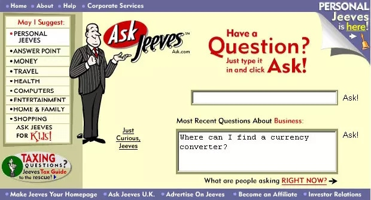

# Session 3: Developing with Generative AI Models  
## Part 3: What is Retrieval-augmented generation (RAG)
Retrieval-augmented generation (RAG) is a technique for enhancing the accuracy and reliability of generative AI models with facts fetched from external sources.

To understand the latest advance in generative AI, imagine a courtroom.

Judges hear and decide cases based on their general understanding of the law. Sometimes a case — like a malpractice suit or a labor dispute — requires special expertise, so judges send court clerks to a law library, looking for precedents and specific cases they can cite.

Like a good judge, large language models (LLMs) can respond to a wide variety of human queries. But to deliver authoritative answers that cite sources, the model needs an assistant to do some research.

The court clerk of AI is a process called retrieval-augmented generation, or RAG for short.

### How It Got Named ‘RAG’
Patrick Lewis, lead author of the 2020 paper that coined the term, apologized for the unflattering acronym that now describes a growing family of methods across hundreds of papers and dozens of commercial services he believes represent the future of generative AI.

“We definitely would have put more thought into the name had we known our work would become so widespread,” Lewis said in an interview from Singapore, where he was sharing his ideas with a regional conference of database developers.

“We always planned to have a nicer sounding name, but when it came time to write the paper, no one had a better idea,” said Lewis, who now leads a RAG team at AI startup Cohere.

### So, What Is Retrieval-Augmented Generation (RAG)?
Retrieval-augmented generation (RAG) is a technique for enhancing the accuracy and reliability of generative AI models with facts fetched from external sources.

In other words, it fills a gap in how LLMs work. Under the hood, LLMs are neural networks, typically measured by how many parameters they contain. An LLM’s parameters essentially represent the general patterns of how humans use words to form sentences.

That deep understanding, sometimes called parameterized knowledge, makes LLMs useful in responding to general prompts at light speed. However, it does not serve users who want a deeper dive into a current or more specific topic.

#### Combining Internal, External Resources
Lewis and colleagues developed retrieval-augmented generation to link generative AI services to external resources, especially ones rich in the latest technical details.

The paper, with coauthors from the former Facebook AI Research (now Meta AI), University College London and New York University, called RAG “a general-purpose fine-tuning recipe” because it can be used by nearly any LLM to connect with practically any external resource.

#### Building User Trust
Retrieval-augmented generation gives models sources they can cite, like footnotes in a research paper, so users can check any claims. That builds trust.

What’s more, the technique can help models clear up ambiguity in a user query. It also reduces the possibility a model will make a wrong guess, a phenomenon sometimes called hallucination.

Another great advantage of RAG is it’s relatively easy. A blog by Lewis and three of the paper’s coauthors said developers can implement the process with as few as five lines of code.

That makes the method faster and less expensive than retraining a model with additional datasets. And it lets users hot-swap new sources on the fly.

### How People Are Using RAG
With retrieval-augmented generation, users can essentially have conversations with data repositories, opening up new kinds of experiences. This means the applications for RAG could be multiple times the number of available datasets.

For example, a generative AI model supplemented with a medical index could be a great assistant for a doctor or nurse. Financial analysts would benefit from an assistant linked to market data.

In fact, almost any business can turn its technical or policy manuals, videos or logs into resources called knowledge bases that can enhance LLMs. These sources can enable use cases such as customer or field support, employee training and developer productivity.

The broad potential is why companies including AWS, IBM, Glean, Google, Microsoft, NVIDIA, Oracle and Pinecone are adopting RAG.

### Getting Started With Retrieval-Augmented Generation 
To help users get started, NVIDIA developed an AI workflow for retrieval-augmented generation. It includes a sample chatbot and the elements users need to create their own applications with this new method.

The workflow uses NVIDIA NeMo, a framework for developing and customizing generative AI models, as well as software like NVIDIA Triton Inference Server and NVIDIA TensorRT-LLM for running generative AI models in production.

The software components are all part of NVIDIA AI Enterprise, a software platform that accelerates development and deployment of production-ready AI with the security, support and stability businesses need.

Getting the best performance for RAG workflows requires massive amounts of memory and compute to move and process data. The NVIDIA GH200 Grace Hopper Superchip, with its 288GB of fast HBM3e memory and 8 petaflops of compute, is ideal — it can deliver a 150x speedup over using a CPU.

Once companies get familiar with RAG, they can combine a variety of off-the-shelf or custom LLMs with internal or external knowledge bases to create a wide range of assistants that help their employees and customers.

RAG doesn’t require a data center. LLMs are debuting on Windows PCs, thanks to NVIDIA software that enables all sorts of applications users can access even on their laptops.

PCs equipped with NVIDIA RTX GPUs can now run some AI models locally. By using RAG on a PC, users can link to a private knowledge source – whether that be emails, notes or articles – to improve responses. The user can then feel confident that their data source, prompts and response all remain private and secure.

A recent blog provides an example of RAG accelerated by TensorRT-LLM for Windows to get better results fast.

### The History of RAG 
The roots of the technique go back at least to the early 1970s. That’s when researchers in information retrieval prototyped what they called question-answering systems, apps that use natural language processing (NLP) to access text, initially in narrow topics such as baseball.

The concepts behind this kind of text mining have remained fairly constant over the years. But the machine learning engines driving them have grown significantly, increasing their usefulness and popularity.

In the mid-1990s, the Ask Jeeves service, now Ask.com, popularized question answering with its mascot of a well-dressed valet. IBM’s Watson became a TV celebrity in 2011 when it handily beat two human champions on the Jeopardy! game show.

Today, LLMs are taking question-answering systems to a whole new level.

### Insights From a London Lab
The seminal 2020 paper arrived as Lewis was pursuing a doctorate in NLP at University College London and working for Meta at a new London AI lab. The team was searching for ways to pack more knowledge into an LLM’s parameters and using a benchmark it developed to measure its progress.

Building on earlier methods and inspired by a paper from Google researchers, the group “had this compelling vision of a trained system that had a retrieval index in the middle of it, so it could learn and generate any text output you wanted,” Lewis recalled.

When Lewis plugged into the work in progress a promising retrieval system from another Meta team, the first results were unexpectedly impressive.

“I showed my supervisor and he said, ‘Whoa, take the win. This sort of thing doesn’t happen very often,’ because these workflows can be hard to set up correctly the first time,” he said.

Lewis also credits major contributions from team members Ethan Perez and Douwe Kiela, then of New York University and Facebook AI Research, respectively.

When complete, the work, which ran on a cluster of NVIDIA GPUs, showed how to make generative AI models more authoritative and trustworthy. It’s since been cited by hundreds of papers that amplified and extended the concepts in what continues to be an active area of research.

### How Retrieval-Augmented Generation Works
At a high level, here’s how an NVIDIA technical brief describes the RAG process.

When users ask an LLM a question, the AI model sends the query to another model that converts it into a numeric format so machines can read it. The numeric version of the query is sometimes called an embedding or a vector.

The embedding model then compares these numeric values to vectors in a machine-readable index of an available knowledge base. When it finds a match or multiple matches, it retrieves the related data, converts it to human-readable words and passes it back to the LLM.

Finally, the LLM combines the retrieved words and its own response to the query into a final answer it presents to the user, potentially citing sources the embedding model found.

### Keeping Sources Current
In the background, the embedding model continuously creates and updates machine-readable indices, sometimes called vector databases, for new and updated knowledge bases as they become available.

Many developers find LangChain, an open-source library, can be particularly useful in chaining together LLMs, embedding models and knowledge bases. NVIDIA uses LangChain in its reference architecture for retrieval-augmented generation.

The LangChain community provides its own description of a RAG process.

Looking forward, the future of generative AI lies in creatively chaining all sorts of LLMs and knowledge bases together to create new kinds of assistants that deliver authoritative results users can verify.

